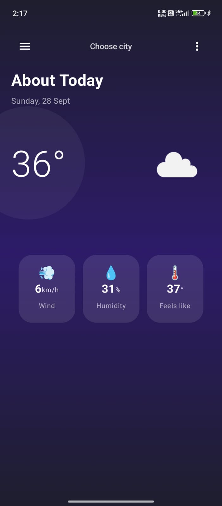

# Weather-App-Clima 🌤️

Weather-App-Clima is a modern Android application that provides real-time weather information for cities worldwide. Built using **Kotlin** and **Jetpack Compose**, the app features a clean UI and seamless user experience.

---

## Features

- Current weather information (temperature, humidity, wind, etc.)
- Forecast for upcoming days
- Search by city
- Clean and modern UI using Jetpack Compose
- Lightweight and fast

---

## Screenshots




---

## Tech Stack

- **Language:** Kotlin  
- **UI:** Jetpack Compose  
- **API:** OpenWeatherMap API  
- **IDE:** Android Studio  
- **Minimum SDK:** 24  
- **Target SDK:** 34  

---

## Installation

1. Clone the repository:

```bash
git clone https://github.com/Sam-06060/Weather-App-Clima.git